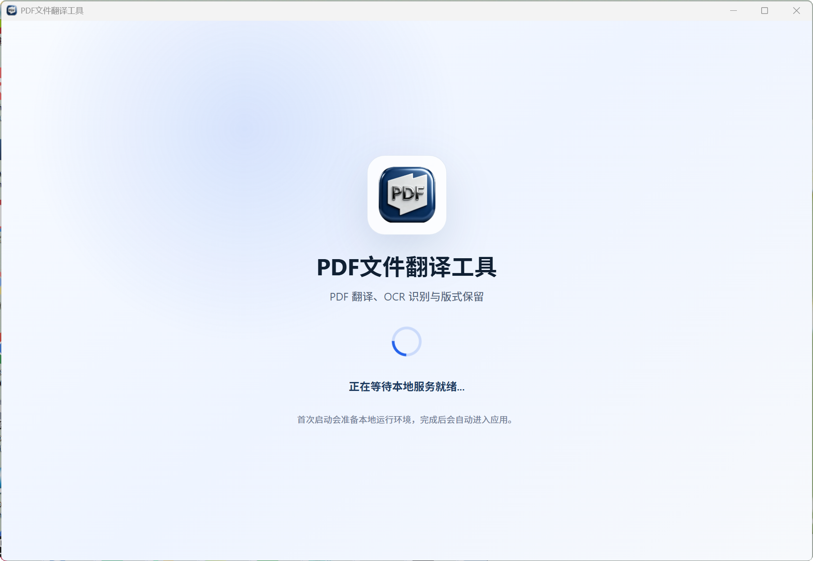
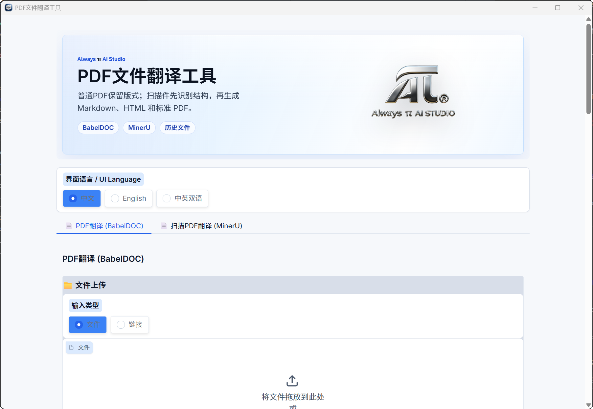

# PDF AI Translate



PDF AI Translate 是基于 [PDFMathTranslate / PDFMathTranslate-next](https://github.com/PDFMathTranslate/PDFMathTranslate-next) 的二次开发版，融合 BabelDOC 版式保留翻译能力，并围绕 Windows 桌面使用体验、扫描文档处理能力和中文用户工作流做了增强。

本项目向 PDFMathTranslate、BabelDOC、MinerU 及其相关开源生态致敬。没有这些基础项目，PDF AI Translate 不可能快速形成一个可用的桌面与 Web 翻译工具。

## 下载

Windows x64 安装包已发布在 GitHub Release：

[PDF-AI-TRANSLATE-2.5.10-windows-x64-setup.exe](https://github.com/xiangxin2021cn/PDF-AI-TRANSLATE/releases/download/v2.5.10/PDF-AI-TRANSLATE-2.5.10-windows-x64-setup.exe)

Release 页面：

[https://github.com/xiangxin2021cn/PDF-AI-TRANSLATE/releases/tag/v2.5.10](https://github.com/xiangxin2021cn/PDF-AI-TRANSLATE/releases/tag/v2.5.10)



## 这个版本做了什么

- 融合 PDFMathTranslate / PDFMathTranslate-next 的 PDF 翻译主流程，保留公式、图表、目录、注释和双语对照等核心能力。
- 修正 Windows 翻译过程中 BabelDOC / Python 子进程反复弹出 cmd 黑窗的问题，提升桌面端观感和稳定性。
- 优化 Windows 下载体验，下载译文时走更符合直觉的原生保存位置选择。
- 美化 Web 与 Windows 桌面共用界面，强化常用翻译参数、历史文件和结果预览的可用性。
- 提升 PDF 预览清晰度，避免本地预览在放大时把低分辨率 canvas 直接拉伸成模糊画面。
- 创新性加入 MinerU 增强流程，用于重度扫描 PDF、图片型论文、版面复杂文档的结构识别与翻译预处理。
- 增强本地 MinerU 大文件处理：本地/vLLM 识别改为按页执行、持续上报状态并缓存页面结果，降低 500 页、1000 页扫描 PDF 因长时间无响应而中断的概率。
- 提供 Rust/Tauri Windows 桌面壳，内置本地 Python 运行环境，面向非开发用户提供一键安装体验。

## 两种文档翻译路线

### BabelDOC / PDFMathTranslate 路线

适合文字层清晰、论文排版标准、需要保留原 PDF 版式的文档。它会尽量维持公式、图表、段落位置和双语对照效果。

### MinerU 增强路线

适合扫描件、图片型 PDF、OCR 需求较重、原文结构复杂或普通 PDF 解析效果不理想的文档。MinerU 负责更强的文档结构解析，后续再进入翻译与预览流程。

从 2.5.10 起，本地/vLLM MinerU 路线不再把整本 PDF 绑定到一次总超时识别中，而是按页识别并逐页落盘。大文件运行中会持续刷新“仍在识别”的状态；如果中途失败或手动停止，已完成页面会保留在项目缓存中，后续重新执行可继续利用已有结果。

## 使用方式

### Windows 桌面版

1. 下载 Release 中的 Windows 安装包。
2. 安装后启动“PDF文件翻译工具”。
3. 选择 BabelDOC 路线或 MinerU 路线。
4. 上传 PDF，配置语言和翻译引擎。
5. 开始翻译，完成后保存译文或在历史记录中查看结果。

### Web UI / 开发运行

开发环境中可使用：

```powershell
uv run pdf2zh_next --gui --server-port 7862
```

然后在浏览器打开本地服务地址。

## 隐私与配置

- 本项目不会要求你把 API Key 写入公开仓库。
- 翻译服务的 API Key、Base URL、Token 等个人配置应只保存在本机配置文件或运行时环境变量中。
- 发布仓库已排除 `.env`、本地配置、缓存、输出文件、便携 Python、node_modules、Rust target、安装包构建缓存等生成物。
- 如果处理机密文件，建议关闭翻译缓存或使用本地/内网翻译服务，并定期清理输出目录和历史记录。

## 致谢

- 向 [PDFMathTranslate / PDFMathTranslate-next](https://github.com/PDFMathTranslate/PDFMathTranslate-next) 致敬：本项目的 PDF 翻译核心能力建立在其工作之上。
- 向 [BabelDOC](https://github.com/funstory-ai/BabelDOC) 致敬：版式保留翻译流程依赖其优秀的 PDF 文档处理能力。
- 向 [MinerU](https://github.com/opendatalab/MinerU) 致敬：扫描文档和复杂版面解析能力为本项目增强路线提供了重要基础。
- 感谢 PyMuPDF、pdfminer.six、Gradio、Gradio PDF、DocLayout-YOLO 等开源项目。

## 许可

本项目作为 PDFMathTranslate / PDFMathTranslate-next 的二次开发版本，遵循上游项目许可要求发布。请在使用、修改和再分发前阅读仓库中的 [LICENSE](LICENSE) 以及上游项目的许可说明。

## 免责声明

本项目按现状提供。PDF 解析、OCR、翻译质量和版式恢复效果会受原始文档质量、翻译服务、模型能力和运行环境影响。请在重要文件、机密文件或正式交付前自行复核翻译结果。
